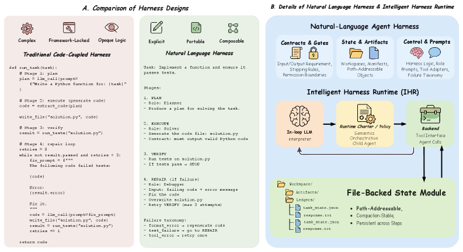

# Natural-Language Agent Harnesses

## Basic info

* Title: Natural-Language Agent Harnesses
* Authors: Linyue Pan et al.
* Year: 2026
* Venue / source: arXiv preprint (cs.CL, cs.AI)
* Link: https://arxiv.org/abs/2603.25723
* HTML: https://arxiv.org/html/2603.25723v1
* Date read: 2026-04-06
* Date surfaced: 2026-04-06
* Surfaced via: Tracy in #pocket-reads
* Why selected in one sentence: It tries to turn the usually half-hidden control logic of agent systems into an explicit, portable, editable artifact, which is exactly the sort of systems-layer question people keep handwaving around.

## Quick verdict

* Highly relevant

This is a sharp paper because it is not mainly about making agents “more powerful” in the usual benchmark-chasing sense. It is about making the harness layer legible enough to study at all. The core claim is that a lot of what determines agent behavior lives in the surrounding scaffold — decomposition logic, verifier gates, state conventions, delegation rules, retry patterns, stopping conditions — yet that scaffold is usually buried in a mess of runtime defaults, controller code, adapters, and prompt fragments. The paper proposes externalizing that layer as a natural-language executable artifact, then evaluating whether that artifact can still do real work under a shared runtime. That is a useful and actually falsifiable question, not just vague “agents need better prompts” fluff.

## One-paragraph overview

The paper introduces **Natural-Language Agent Harnesses (NLAHs)**, a way to express high-level agent harness behavior as editable natural language rather than scattering it across runtime-specific code. It pairs this with an **Intelligent Harness Runtime (IHR)** that interprets the harness through explicit contracts, persistent file-backed state, lightweight adapters, and a shared runtime charter. The central idea is to separate three things more cleanly: the backend with actual tool access and child-agent support, the shared runtime semantics that define policy and execution behavior, and the benchmark- or task-family-specific harness logic that determines workflow structure. Across coding and computer-use settings, the paper studies whether making harness logic explicit in this way is operationally viable, whether harness patterns can be composed and ablated as modules, and how close a reconstructed natural-language harness can get to its original source-code implementation.

## Model definition

### Inputs
Task instances for coding and computer-use benchmarks, plus a natural-language harness specification interpreted by a shared runtime with tool and child-agent support.

### Outputs
Task completions, artifact traces, delegated child-agent runs, verifier outputs, and benchmark outcomes produced under the harness-defined workflow.

### Training objective (loss)
This is not a model-training paper. The contribution is a systems/runtime design and an empirical study of harness representation and execution.

### Architecture / parameterization
The architecture has three major layers:
- a **backend** that exposes tools, execution, and child-agent support,
- an **Intelligent Harness Runtime (IHR)** that supplies shared runtime semantics through a runtime charter,
- and a **Natural-Language Agent Harness (NLAH)** that specifies task-family logic such as roles, contracts, stages, adapters, and state conventions.

A notable design point is **file-backed state as an explicit module**, treating persistent artifacts and state surfaces as first-class parts of harness behavior rather than incidental implementation details.

## Method figures from the paper

For this paper, the most relevant figures are not generic result plots but the ones that define the paper’s conceptual object.

**Figure 1 — harness design patterns**

**Figure 2 — framework overview of IHR + NLAH**

**Figure 3 — realization mapping**

**Why these are the right figures:** Figure 1 defines the design-pattern layer the paper is trying to make studyable; Figure 2 gives the actual runtime architecture; Figure 3 makes the backend/runtime/harness split explicit, which is probably the most reusable conceptual contribution in the paper.

## Key questions this summary must address

### 1. What problem is the paper trying to solve?
The paper is trying to solve a methodological problem in agent research: **harness engineering matters a lot, but it is usually not represented as a clean scientific object**. In practice, an agent’s behavior depends not just on the model and tools, but on a larger control stack that decides how to decompose work, when to verify, what state to persist, how to delegate, when to stop, and how to recover from failure. That logic is often smeared across code, prompts, wrappers, runtime defaults, and infrastructure assumptions.

This makes harnesses hard to:
- transfer across runtimes,
- compare fairly,
- ablate cleanly,
- and study as reusable patterns rather than one-off glue.

So the paper asks whether the high-level harness layer can be externalized into a portable executable artifact without collapsing into vagueness or becoming purely descriptive theater.

### 2. What is the method?
The method is to represent high-level harness logic in natural language and execute it under a shared runtime with explicit semantics.

The main pieces are:
- **Natural-Language Agent Harnesses (NLAHs):** editable natural-language specifications of task-family harness logic.
- **Intelligent Harness Runtime (IHR):** the runtime that interprets and executes those harnesses.
- **Runtime charter:** a shared policy/semantics layer carried by the runtime rather than the task-specific harness.
- **File-backed state:** explicit durable artifacts and state conventions, so the run has visible structure beyond transient prompt context.

The experiments then test three things:
- whether the runtime + harness stack has a real behavioral effect,
- whether harness modules can be composed and ablated cleanly,
- and whether code-native harnesses can be reconstructed into natural-language harnesses with similar behavior under the shared runtime.

### 3. What is the method motivation?
The motivation is good and concrete: people talk about “prompt engineering,” but long-horizon agents increasingly live or die by something broader — context engineering, state handling, delegation, verification, and workflow structure. If that layer remains buried in code and framework conventions, then the field cannot really compare or accumulate knowledge about it.

The authors want to pull the harness pattern layer into the open. Natural language is attractive here not because it is magically better than code, but because it is editable, legible, and portable at the level of high-level control logic. Code can still handle deterministic operations and tool interfaces; the claim is that the **policy and workflow layer** can be exposed in a more analyzable form.

### 4. What data does it use?
The paper evaluates on coding and computer-use benchmarks. The extracted HTML text explicitly discusses **SWE-bench Verified**, **Live-SWE**, and **OSWorld**, and compares different harness realizations and ablations under shared runtime assumptions.

This is important because the task families are not toy one-step QA tasks; they are exactly the kind of long-horizon environments where harness structure should matter.

### 5. How is it evaluated?
The paper is organized around three research questions:
- **RQ1: Behavioral Effect** — does the shared runtime charter and harness logic materially change system behavior and outcomes?
- **RQ2: Composability** — can explicit harness modules be composed and ablated at the pattern level?
- **RQ3: Migration** — how close do reconstructed natural-language harnesses get to native code harnesses under a shared runtime?

It reports not just success/performance metrics, but also process metrics like:
- prompt tokens,
- completion tokens,
- tool calls,
- LLM calls,
- runtime,
- and paired flip analyses where Full IHR and ablations differ on the same instances.

That is the right evaluation style for a harness paper, because the point is not only whether the resolved rate moves, but whether the harness changes the actual execution behavior in meaningful, inspectable ways.

### 6. What are the main results?
The strongest result is not “NLAHs crush baselines.” It is subtler and more interesting.

First, **the harness and runtime materially change process behavior**, often much more than they change headline solved rate. Full IHR tends to increase tool use, LLM calls, runtime, and delegated-child activity, showing that the harness layer is behaviorally real rather than prompt decoration.

Second, **module-level ablation becomes possible** once the pattern layer is explicit. That is scientifically useful even when the raw performance deltas are modest.

Third, **code-to-text migration is meaningfully possible but not perfect**. The paper argues that reconstructed natural-language harnesses can preserve enough of the high-level workflow logic to become a real comparison object under shared semantics.

The paper is refreshingly honest that the story is not monotonic “more harness = always better.” In some cases the extra structure improves organization or exploration but drifts away from the shortest benchmark-aligned repair path. That is exactly the kind of tradeoff a serious harness paper should expose.

### 7. What is actually novel?
The real novelty is not just “write instructions in natural language.” It is the paper’s attempt to define and operationalize a distinct scientific layer: the **harness design-pattern layer**.

Specific novel moves include:
- treating harness logic as a first-class artifact separate from backend and runtime,
- defining a shared runtime that interprets that artifact under explicit semantics,
- making durable state and artifact contracts explicit,
- and studying code-to-text harness migration as an empirical question.

The explicit backend/runtime/harness split in Figure 3 is especially valuable because it gives people a cleaner vocabulary for what exactly is being compared in agent systems.

### 8. What are the strengths?
- It asks a real systems question that is easy to handwave and hard to study well.
- The runtime/harness separation is conceptually clean.
- It evaluates process metrics, not just end-task scores.
- It treats file-backed state as a real design decision rather than hidden plumbing.
- It does not oversell natural language as a replacement for code; the boundary is more disciplined than that.
- It offers a plausible path toward cumulative harness research instead of endless one-off scaffold folklore.

### 9. What are the weaknesses, limitations, or red flags?
- Natural language can still be ambiguous, and runtime interpretation can hide a lot of practical rigidity behind a supposedly portable representation.
- A shared runtime is useful for comparison, but it also means portability is only as good as the runtime’s semantic contract.
- If reconstructed harnesses differ subtly from code-native ones, it may be hard to know whether the gap comes from representation loss, runtime mismatch, or missing tacit assumptions.
- Benchmark-aligned success can still diverge from “better organized” agent behavior, which makes simple adoption stories messy.
- The paper’s authors are clearly sympathetic to the framing, so downstream replication by other groups would matter a lot.

### 10. What challenges or open problems remain?
A major open problem is whether harness logic can be represented in a way that is both **editable and precise** without quietly collapsing back into code. Another is how to standardize runtime semantics enough that harness comparisons across labs or platforms are actually fair. There is also a broader question of whether harness representation should remain natural language, evolve into mixed text-plus-DSL forms, or become some richer typed artifact.

### 11. What future work naturally follows?
- Cross-runtime harness transfer studies beyond one shared runtime family.
- Better typed or semi-structured harness formats that preserve editability while reducing ambiguity.
- More serious harness libraries where modules like verification, delegation, memory, and search can be swapped and benchmarked systematically.
- Stronger artifact-level observability and debugging tools for harness execution.
- Domain-specific harness studies outside coding/computer-use, such as science agents, research assistants, or robotics workflows.

### 12. Why does this matter?
Because agent research keeps rediscovering that a lot of the real intelligence is in the scaffold, then immediately burying that scaffold in unportable implementation junk. This paper matters because it tries to make that layer explicit enough to compare, ablate, and migrate. Even if NLAHs are not the final representation, the paper is probably right that **harnesses need to become first-class research artifacts** rather than incidental glue.

## Why It Matters

The useful move here is not “natural language beats code.” It is that the paper identifies a missing unit of analysis in agent systems: the high-level harness logic that shapes decomposition, verification, delegation, and state. If the field wants something like a science of agent scaffolds instead of endless benchmark anecdotes, that layer has to become legible somehow. This paper is one of the cleaner attempts I’ve seen to do that.

### 13. What ideas are steal-worthy?
- Separate backend, runtime semantics, and task-family harness logic explicitly.
- Treat durable artifacts and file-backed state as deliberate harness modules.
- Measure process behavior, not just solved rate, when studying agents.
- Study code-to-text migration as a real systems question rather than assuming prompts can or cannot replace scaffolds.
- Think of harness patterns as reusable research objects: verification, delegation, memory, search, orchestration.

### 14. Final decision
Keep.

This is a good paper because it is trying to make agent harnesses less mystical and more inspectable. The strongest takeaway is not that natural language is the One True Representation. It is that the harness layer deserves to be externalized, compared, and studied on purpose. That alone makes it a useful reference point for anyone building or analyzing serious agents.