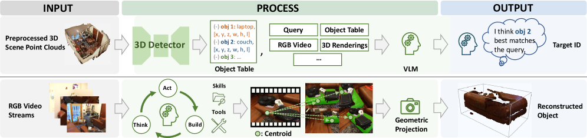
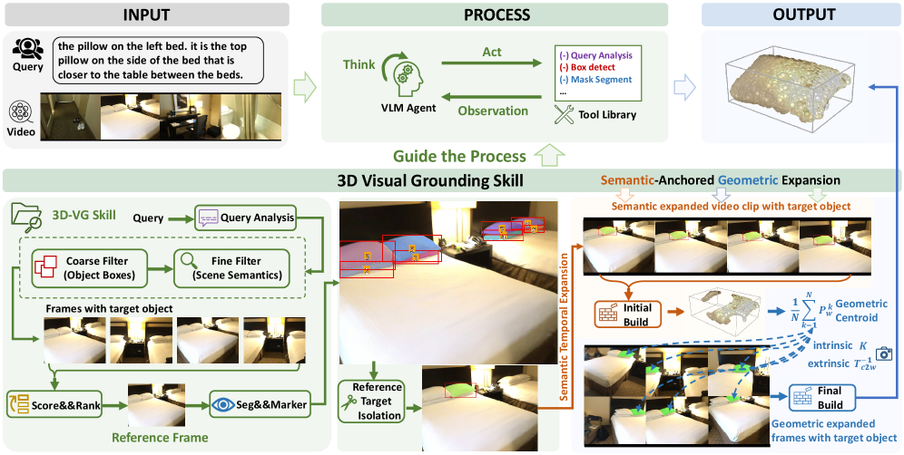

# Think, Act, Build: An Agentic Framework with Vision Language Models for Zero-Shot 3D Visual Grounding

## Basic info

* Title: Think, Act, Build: An Agentic Framework with Vision Language Models for Zero-Shot 3D Visual Grounding
* Authors: Haibo Wang, Zihao Lin, Zhiyang Xu, Lifu Huang
* Year: 2026
* Venue / source: arXiv preprint (cs.CV)
* Link: https://arxiv.org/abs/2604.00528
* PDF: https://arxiv.org/pdf/2604.00528.pdf
* Date read: 2026-04-05
* Date surfaced: 2026-04-05
* Surfaced via: Tracy in #pocket-reads
* Why selected in one sentence: It is a sharp example of the current “agentic VLMs should call tools and let geometry do the hard physical work” thesis, applied to zero-shot 3D visual grounding rather than generic embodied demos.

## Quick verdict

* Highly relevant

This is one of the more convincing recent “agentic VLM” papers because it does not use agency as decorative frosting. The core point is specific and actually useful: 3D visual grounding should not be reduced to selecting among precomputed 3D proposals, and it also should not depend on brittle pure-semantic matching across views. TAB instead lets a VLM reason in 2D, call visual tools, and then hand off the actual physical instantiation to deterministic multi-view geometry. That decomposition is much healthier than pretending one giant multimodal model should solve semantics, tracking, reconstruction, and metric localization all in one latent blur. The paper is also unusually valuable for calling out benchmark noise and manually refining broken queries instead of quietly treating flawed labels as sacred scripture.

## One-paragraph overview

TAB reframes zero-shot 3D visual grounding as an iterative Think–Act–Build loop operating directly on RGB-D video streams rather than on preprocessed 3D point clouds. Given a natural-language referring expression, a VLM agent first parses the query, uses tool calls for coarse detection and fine semantic filtering, isolates a reference instance with segmentation and visual markers, and then reconstructs the target object by combining semantic tracking with deterministic geometry. Its key technical move is a Semantic-Anchored Geometric Expansion step: instead of trying to semantically track the target through every hard viewpoint change, it first builds a reliable local 3D anchor from nearby frames, computes the object centroid, then geometrically projects that anchor into additional frames to recover coverage that semantic-only tracking would miss. The final 3D bounding box comes from inverse-projecting the aggregated masks into world coordinates and cleaning the resulting point cloud. On ScanRefer and Nr3D, this open-source pipeline outperforms previous zero-shot systems and even beats several supervised baselines.

## Model definition

### Inputs
A free-form natural-language query plus sequential RGB-D video frames with aligned depth maps and camera intrinsics/extrinsics.

### Outputs
A grounded 3D object, represented as a reconstructed point cloud and an estimated 3D bounding box for the referred target.

### Training objective (loss)
There is no new end-to-end training objective for TAB itself. The method is a training-free systems pipeline built on top of pretrained open-source components, including a VLM, detector, and segmenter, together with geometric projection and reconstruction.

### Architecture / parameterization
The system is an agentic pipeline organized around a 3D-VG skill blueprint. A VLM agent iteratively reasons about the next step, invokes tools such as query analysis, object detection, segmentation, and ranking, and interleaves those with geometric reconstruction. The central technical mechanism is Semantic-Anchored Geometric Expansion, which combines local semantic temporal expansion with global multi-view geometric projection.

### Method figures from the paper

You were right to want the actual paper figures here rather than the weaker extracted panel I used before. For TAB, the methodology is best represented by **Figure 1** and **Figure 2** together: the first gives the overall framework intuition, and the second shows the concrete staged pipeline in more detail.

**Figure 1 — framework / problem setup**

**Figure 2 — detailed TAB methodology pipeline**

**Why these are the right methodology figures:** Figure 1 establishes the paper’s actual framing of the task and framework, while Figure 2 shows the real decomposition of the method into semantic disambiguation, expansion, and geometric reconstruction. Together they capture the method much better than a single downstream panel.

## Key questions this summary must address

### 1. What problem is the paper trying to solve?
The paper is trying to solve zero-shot 3D visual grounding in a setting that looks more like the real problem and less like a benchmark convenience trick. A lot of prior work claims zero-shot 3D grounding but assumes you already have a preprocessed 3D scene point cloud and candidate object proposals. At that point the task is basically “pick the right box from a menu,” which is much easier than grounding an object from raw observations. Other methods try to ground directly from 2D views but rely too heavily on brittle semantic matching across frames, which breaks under occlusion, close-ups, and viewpoint shifts.

So the real problem here is: given a natural-language query and raw RGB-D video, can a system locate and reconstruct the referred object in 3D without requiring dataset-specific 3D proposal infrastructure or additional 3D training?

### 2. What is the method?
TAB has three conceptual stages.

First, the agent establishes a **reference target**. It parses the query into object class, attributes, and spatial constraints; uses detectors for coarse candidate filtering; uses a VLM for finer scene-level filtering; and then isolates the exact instance in a selected reference frame by segmenting all candidate objects and marking them with numeric IDs for the VLM to reason over.

Second, it performs **Semantic-Anchored Geometric Expansion**, the core contribution. This has two parts:
- **Semantic Temporal Expansion:** starting from the reference frame, the agent tracks the target through nearby frames where semantic consistency is still reliable, segments the object in those frames, and reconstructs an initial local 3D point cloud.
- **Multi-View Geometric Expansion:** from that local reconstruction, it computes a 3D centroid anchor, projects that anchor into additional frames using camera geometry, checks visibility with field-of-view and depth/occlusion constraints, and then uses the projected point as a prompt for segmentation. This recovers views that pure semantic tracking would likely miss.

Third, it performs **2D-to-3D reconstruction** by inverse-projecting masked pixels from all recovered frames into world coordinates, then cleaning the resulting point cloud and fitting a final axis-aligned 3D box.

### 3. What is the method motivation?
The motivation is crisp: let the VLM do what it is actually good at, and stop asking it to do the geometry by vibes. The authors argue that 2D VLMs are useful for parsing complex language and resolving semantic ambiguity, but the actual 3D structure should come from deterministic multi-view geometry. They also observe that purely semantic tracking produces a multi-view coverage deficit, because the target may remain physically visible even when the language conditions or contextual cues become hard to verify from a given angle.

So the system uses semantics to establish identity, then geometry to propagate that identity into harder views. That decomposition is the paper’s core intellectual contribution.

### 4. What data does it use?
The experiments are on **ScanRefer** and **Nr3D**, both built on ScanNet indoor RGB-D scenes. The method works from RGB-D image sequences with camera intrinsics and extrinsics. The paper also manually reviews and refines problematic queries in the evaluation subsets, fixing ambiguity, object-category mistakes, and spatial-relation errors.

### 5. How is it evaluated?
The paper reports standard grounding metrics:
- On **ScanRefer**, Acc@0.25 and Acc@0.5 IoU for Unique, Multiple, and Overall subsets.
- On **Nr3D**, top-1 selection accuracy on Easy/Hard, View-Dependent/Independent, and Overall subsets.

It compares against both zero-shot methods and supervised baselines. It also includes ablations that remove the semantic temporal expansion and/or the multi-view geometric expansion, which is important because this paper’s whole claim rests on the combination of those two modules.

### 6. What are the main results?
The main result is that TAB is very strong in the genuinely zero-shot setting.

On **ScanRefer**, operating directly on raw RGB-D streams without point-cloud proposals, it reports **71.2 Acc@0.25** and **46.4 Acc@0.5** overall. That is better than prior zero-shot methods in the same regime and competitive with, or beyond, several supervised systems. With optional 3D proposal refinement for comparison against proposal-based pipelines, it rises to **61.6 Acc@0.5**.

On **Nr3D**, TAB reports **68.0 overall accuracy**, exceeding prior zero-shot approaches like SPAZER and even beating some supervised baselines such as SceneVerse.

The ablations matter a lot:
- single-frame reconstruction is much worse,
- adding only one expansion mechanism helps,
- using both semantic temporal expansion and multi-view geometric expansion gives the best results by a wide margin.

So the paper’s central mechanism does seem to earn its keep instead of being decorative complexity.

### 7. What is actually novel?
The novelty is not just “we used an agent.” The real novelty is the specific decomposition of the task:
- interpret language and resolve referential ambiguity with a VLM in 2D,
- use tool calls to isolate the target instance,
- construct a local geometric anchor from semantically reliable frames,
- then expand coverage with deterministic geometry rather than more brittle semantic matching.

The benchmark refinement effort is also a useful contribution. A surprising amount of evaluation progress in this area gets confounded by label and query noise, and this paper actually addresses that instead of ignoring it.

### 8. What are the strengths?
- It attacks a more honest version of zero-shot 3D grounding than proposal-picking pipelines.
- The semantics/geometry split is sensible and technically well motivated.
- The geometric expansion step directly addresses the failure mode of semantic-only tracking.
- It is built entirely from open-source models rather than hidden proprietary scaffolding.
- The ablation story is pretty clear and supports the claimed mechanism.
- Cleaning up benchmark annotation noise is useful community work, not just self-serving evaluation theater.

### 9. What are the weaknesses, limitations, or red flags?
- It still assumes **RGB-D** streams with camera parameters, which is much more structured input than arbitrary monocular internet video. This is fair for ScanNet-style embodied grounding, but it is not general open-world grounding from unconstrained video.
- The final box is **axis-aligned**, which is practical but not the richest notion of 3D localization.
- As with many agentic systems papers, a lot of the practical quality may depend on careful prompting and tool orchestration details that can be brittle.
- The benchmark-refinement step is good, but it also complicates apples-to-apples comparisons with older results unless the refined subsets are clearly standardized.
- The method is still a multi-module pipeline, so upstream detector/segmenter errors can propagate.

### 10. What challenges or open problems remain?
A big open problem is how to get the benefits of explicit geometry without depending on RGB-D sensor infrastructure and clean camera calibration. Another is scaling from indoor grounding with relatively stable scenes to messier real-world embodied settings with dynamic clutter, bad depth, and weaker priors. There is also still a gap between grounding a referred object and doing more general 3D semantic interaction or manipulation planning over the scene.

### 11. What future work naturally follows?
- Extending this kind of agentic grounding to weaker sensor setups, especially monocular or partially calibrated settings.
- Moving beyond centroid-based anchors and axis-aligned boxes toward richer object geometry.
- Tighter integration between VLM reasoning and geometric uncertainty, rather than a relatively staged handoff.
- Standardized benchmark cleanup so the field is not benchmarking on mislabeled nonsense.
- Applying the same semantic-anchor-plus-geometry-expansion pattern to embodied manipulation or navigation.

### 12. Why does this matter?
Because a lot of multimodal-agent rhetoric still handwaves the difference between semantic plausibility and physical grounding. TAB matters because it shows a more disciplined recipe: let the language model interpret the query and resolve ambiguous references, but let geometry do the physically binding work. That is the right instinct for systems that need to act in space rather than merely describe images. It is also a useful reminder that “zero-shot 3D grounding” should mean grounding from observations, not just picking from precomputed 3D menus.

## Why It Matters

This paper matters because it turns “agentic VLMs” into something less fluffy and more operational. The system succeeds not by making the agent magically smarter in the abstract, but by giving it a sane division of labor: semantics for deciding what to look for, geometry for deciding where it actually is. That pattern is probably more broadly important than the specific benchmark wins.

### 13. What ideas are steal-worthy?
- Use a VLM to reason over segmented candidates with explicit numeric markers when instance disambiguation matters.
- Treat semantic tracking as a way to get a reliable local anchor, not as the whole tracking solution.
- Use geometry to expand coverage after identity is established, instead of repeatedly asking semantics to survive every viewpoint shift.
- Audit benchmark query quality as part of serious empirical work.
- Frame 3D grounding as reconstruction from observations rather than proposal classification over a prebuilt scene representation.

### 14. Final decision
Keep.

This is a strong paper with a real systems idea inside it, not just benchmark garnish. The key move is simple enough to remember and general enough to reuse: semantic reasoning should establish the target, but geometric operations should carry the burden of physically consistent multi-view grounding. That is a much better recipe than either static proposal menus or semantic tracking alone.